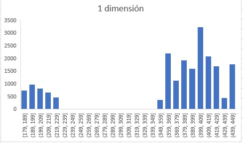
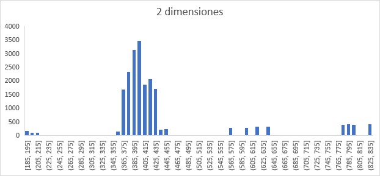
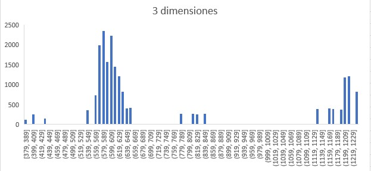
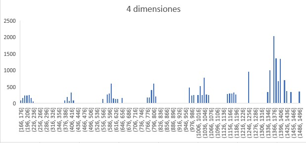
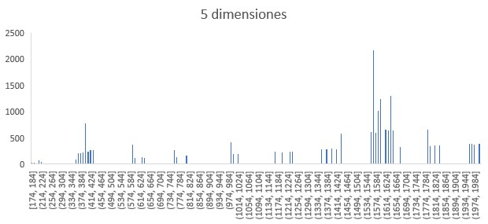

# EDA_Clustering
Un repositorio que incluye el trabajo realizado sobre clustering en datos n-dimensionales

Source.cpp incluye el código en C++ utilizado para este trabajo, que incluye las funciones de generado de conjuntos de datos, cálculo de las distancias euclidianas entre un punto determinado (en este caso, el primero del conjunto) y la agrupación de estas distancias en intervalos de 10 (esto debido a que, en caso contrario, la dispersión de los histogramas sería mucho mayor).

Nota: Los gráficos incluidos contienen los conjuntos de datos de hasta 5 dimensiones, debido a que el tiempo requerido para completar el proceso con 6 dimensiones a más es inmensamente grande.

# Gráficos

## 1 dimensión:

## 2 dimensiones:

## 3 dimensiones:

## 4 dimensiones:

## 5 dimensiones:

Todo el contenido en este repositorio es originalmente creado por Diego Nicolás Vílchez Gustavson, y su reproducción o copia está prohibida sin el permiso correspondiente.
